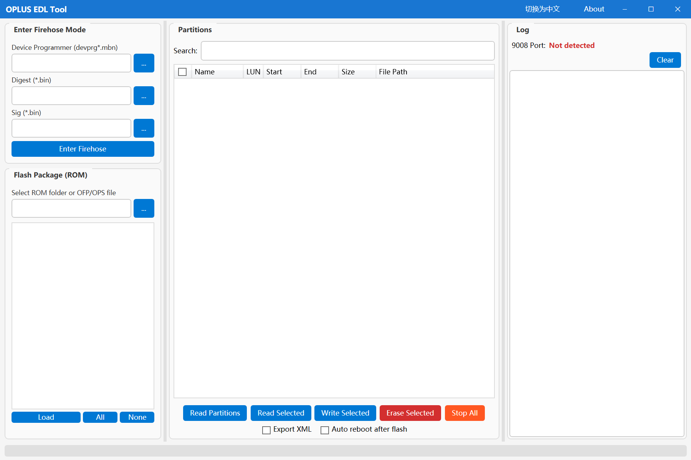

# OPLUS EDL Tool v1

一个开源的OPLUS手机EDL模式刷机工具，支持大多数OPLUS手机的EDL模式操作。

**[English Version](README_EN.md) | 中文版本**

## ⚠️ 重要声明

**此工具仅供技术研究和开发使用，使用本工具可能导致设备损坏、数据丢失或失去保修资格。请在使用前充分了解相关风险，开发者不对任何因使用本工具造成的损失负责。**

## 🚀 功能特性

### 当前版本 (v1)
- ✅ EDL模式检测与连接
- ✅ Firehose协议支持
- ✅ 分区表读写
- ✅ XML配置文件处理
- ✅ 分区清理功能
- ✅ 多语言支持（中英文）
- ✅ 图形化界面操作
- ✅ 管理员权限运行

### 支持的手机型号
- 支持大多数OPLUS手机EDL模式
- 部分新型号手机需要用户自行测试，不保证完全兼容

## 📋 系统要求

- Windows 7/8/10/11 (64位推荐)
- .NET 8.0 Runtime
- 管理员权限
- USB 2.0/3.0 接口

## 🔧 安装使用

### 快速开始
1. 下载最新版本的发布包
2. 解压到任意目录
3. 右键 `OplusEdlTool.exe` → "以管理员身份运行"
4. 将手机进入EDL模式并连接电脑
5. 按照界面提示进行操作

### 进入EDL模式方法
不同机型进入EDL模式的方法可能不同，常见方法：
- 完全关机后，按住音量上下键同时插入USB线
- 使用ADB命令：`adb reboot edl`
- 使用fastboot命令：`fastboot oem edl`

## 📖 使用说明

### 软件截图

*主应用程序界面，显示所有可用功能*

#### 功能使用

*功能使用相关截图*

### 主界面功能
- **Firehose**: Firehose协议操作
- **Partitions**: 分区管理
- **Read XML**: 读取XML配置
- **Write XML**: 写入XML配置  
- **Cleanup**: 分区清理

### 注意事项
- 操作前请备份重要数据
- 确保手机电量充足（建议50%以上）
- 使用原装或高质量USB线
- 操作过程中不要断开连接

## 🔄 版本信息

### v1版本
- 当前开源版本
- 支持大多数主流OPLUS手机
- 基础功能完整

### v2版本
如需使用更高级的v2版本，请访问：
**https://static-tcdn.anteasy.com/xasdun/upload-log/oet-upload.html**

v2版本可能包含：
- 更广泛的设备支持
- 高级功能
- 专业技术支持

## 🛠️ 编译构建

### 开发环境
- Visual Studio 2022 或更高版本
- .NET 8.0 SDK
- Windows SDK

### 构建步骤
```bash
# 克隆仓库
git clone https://github.com/salokrwhite/OplusEdlTool_v1.git

# 进入项目目录
cd OplusEdlTool_v1  

# 还原依赖
dotnet restore

# 构建项目
dotnet build -c Release
```

## 📄 许可证

本项目采用 MIT 许可证 - 详见 [LICENSE](LICENSE) 文件

## 🤝 贡献

欢迎提交Issue和Pull Request来改进这个项目！

## 📞 支持与反馈

- 提交Issue: [GitHub Issues](https://github.com/salokrwhite/OplusEdlTool_v1/issues)

## ⚖️ 法律声明

本工具仅供教育和研究目的。用户应遵守当地法律法规，不得用于任何非法活动。开发者不对工具的滥用承担责任。
---

**⭐ 如果这个项目对您有帮助，请给个Star支持一下！**