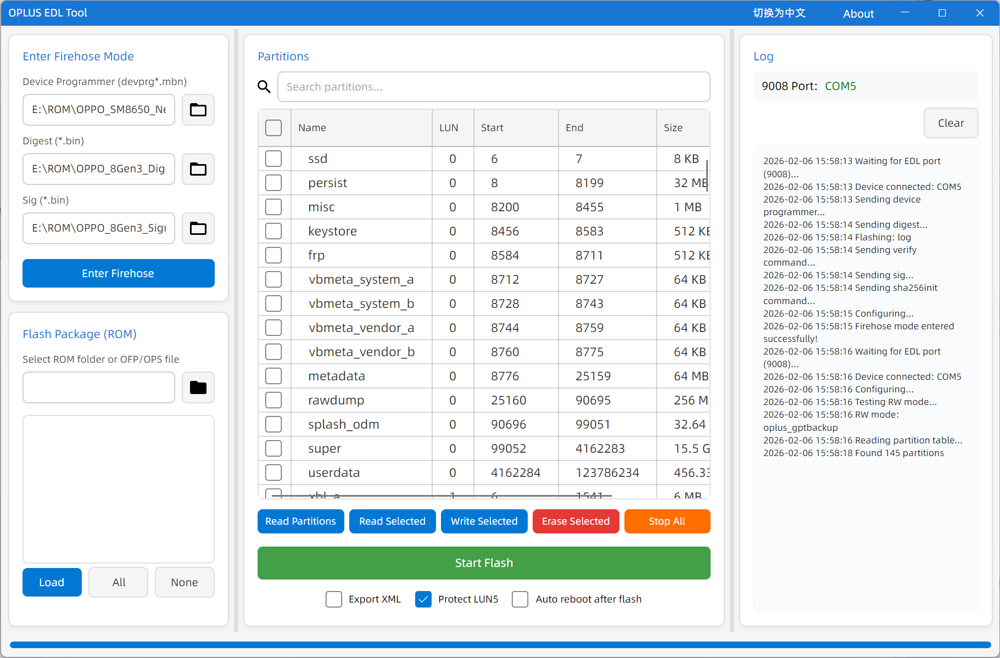

# OPLUS EDL 工具 (v2)

🌐 **语言:** [English](README.md) | [中文](README.zh.md)

> **⚠️ 版本说明：** 这是 **v2** 版本，是原工具的重大重写版本。旧版 v1（基于 WPF）的代码已归档在 [`v1_old_code/`](v1_old_code/) 目录中供参考。
>
> 🚀 **最新版本：** 新版 **v3**（闭源）可[在此下载](https://static-tcdn.anteasy.com/xasdun/upload-log/oet-upload.html)

一个基于 Avalonia UI 开发的跨平台 EDL（紧急下载模式）刷机工具，适用于 OPLUS（OPPO/OnePlus/Realme）设备。

## v2 更新内容

v2 是完全重写的版本，包含以下改进：

- **全新 UI 框架**：从 WPF 迁移到 **Avalonia UI**
- **更好的架构**：更清晰的代码结构，更易于维护
- **性能提升**：分区解析和刷入操作更快
- **原生 AOT 编译**：单文件发布，无需安装 .NET 运行时，启动速度更快

## 功能特性

- **进入 Firehose 模式**：加载设备编程器（devprg*.mbn）及对应的摘要和签名文件
- **刷入 ROM 包**：支持解压后的 ROM 文件夹、OFP 和 OPS 加密包
- **分区管理**：
  - 从设备读取分区表
  - 读写/擦除单个分区
  - 批量刷入选定分区
- **超级分区支持**：自动合并分段的超级镜像（super.0.xxx.img, super.1.xxx.img 等），支持根据 super_def.00000000.json 定义合并
- **多语言支持**：中英文界面
- **自动端口检测**：自动检测高通 9008 EDL 端口

## 截图

### 读取分区表


### 备份分区


## 系统要求

- Windows 10/11 (x64)
- .NET 8.0 运行时
- 已安装高通 USB 驱动

## 从源码构建

### 前置条件

- .NET 8.0 SDK
- Visual Studio 2022 或 JetBrains Rider（可选）

### 构建命令

```bash
# 克隆仓库
git clone https://github.com/salokrwhite/Oplus_EDL_Tool.git
cd Oplus_EDL_Tool

# 恢复依赖
dotnet restore

# 构建
dotnet build

# 运行
dotnet run

# 发布（AOT 编译）
dotnet publish -c Release
```

## 使用说明

### 1. 进入 Firehose 模式

如果您的设备处于 EDL 模式但未进入 Firehose 模式：

1. 选择设备编程器文件（devprg*.mbn）
2. 选择摘要文件（*.bin）
3. 选择签名文件（*.bin）
4. 点击 "Enter Firehose" 按钮

### 2. 刷入 ROM 包

1. 点击文件夹按钮选择 ROM 源：
   - **文件夹**：选择包含 IMAGES 目录的解压后的 ROM 文件夹
   - **文件**：选择 OFP 或 OPS 加密 ROM 文件（会自动解密）
2. 选择要加载的 rawprogram XML 文件
3. 点击 "Load" 解析分区
4. 选择要刷入的分区（使用复选框）
5. 点击 "Start Flash" 开始刷入

### 3. 分区操作

- **Read Partitions**：从设备读取分区表
- **Read Selected**：将选定的分区备份到文件
- **Write Selected**：将选定的分区写入设备
- **Erase Selected**：擦除选定的分区

### 选项

- **Export XML**：备份时将选定的分区导出为 rawprogram XML
- **Protect LUN5**：跳过刷入 rawprogram5.xml 中的分区以保护 LUN5
- **Auto Reboot**：刷入完成后自动重启设备

## 项目结构

```
OplusEdlTool/
├── App.axaml              # 应用程序 XAML
├── App.axaml.cs           # 应用程序入口点
├── MainWindow.axaml       # 主窗口 UI
├── MainWindow.axaml.cs    # 主窗口逻辑
├── AboutWindow.axaml      # 关于对话框
├── Services/
│   ├── EdlService.cs      # EDL 通信服务
│   ├── LanguageService.cs # 多语言支持
│   ├── OfpDecryptor.cs    # OFP 文件解密
│   ├── OpsDecryptor.cs    # OPS 文件解密
│   ├── GptParser.cs       # GPT 分区表解析器
│   ├── RawProgramXmlProcessor.cs  # rawprogram XML 解析器
│   ├── SuperMergeService.cs       # 超级分区合并
│   └── ProcessRunner.cs   # 外部进程运行器
├── Tools/                 # 外部工具
│   ├── fh_loader.exe      # 高通 Firehose 加载器
│   ├── QSaharaServer.exe  # 高通 Sahara 协议服务器
│   ├── lsusb.exe          # USB 设备检测
│   ├── simg2img.exe       # 稀疏镜像转换器
│   └── lpmake.exe         # 动态分区（super）镜像创建工具
└── Fonts/                 # 自定义字体
```

## 依赖项

- [Avalonia UI](https://avaloniaui.net/) - 跨平台 UI 框架
- [System.Management](https://www.nuget.org/packages/System.Management/) - 用于设备检测的 WMI 访问

## 免责声明

**风险自负！**

本工具仅用于教育和开发目的。刷入固件可能会导致设备变砖。作者不对使用本工具造成的任何损坏负责。

- 刷入前请务必备份您的数据
- 确保您有适合您设备的正确固件
- 除非您知道自己在做什么，否则不要刷入 persist 分区

## 许可证

本项目是开源的。有关详细信息，请参阅 [LICENSE](LICENSE) 文件。

## 贡献

欢迎贡献！请随时提交问题和拉取请求。

## 致谢

- Qualcomm 提供的 Firehose 协议
- Android 开发社区
- 酷安@某贼

